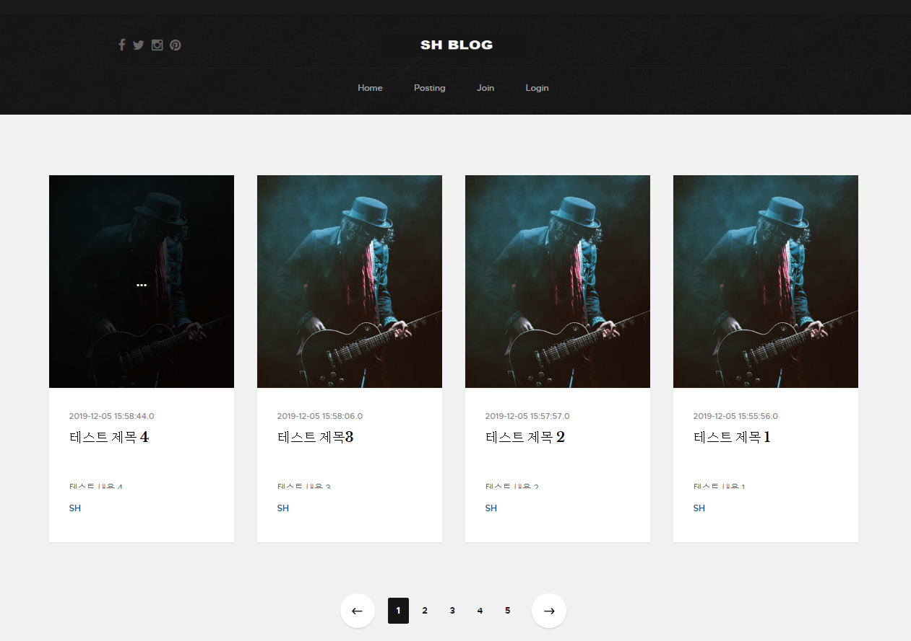

# Spring-Mybatis-Blog
#### 나만의 블로그 만들기 Spring+Mybatis+MySQL

- git주소 : <https://github.com/suhun918/Spring-Mybatis-Blogl>



#### 1. 사용자 생성 및 권한 주기 및 DB 생성
- create user 'sh'@'%' identified by 'bitc5600';
- GRANT ALL PRIVILEGES ON *.* TO sh@%;
- create database sh;
- use sh;

#### 2. 테이블
```sql
CREATE TABLE user(
   id int auto_increment primary key,
    username varchar(100) not null unique,
    password varchar(100) not null,
    email varchar(100) not null,
    userProfile varchar(300) default '/images/userProfile.png',
    createDate timestamp
) engine=InnoDB default charset=utf8;
```

```sql
CREATE TABLE post(
    id int auto_increment primary key,
    userId int,
    title varchar(100) not null,
    content longtext,
    createDate timestamp,
    foreign key (userId) references user (id)
) engine=InnoDB default charset=utf8;
```

#### 5. 실행 영상
-youtube주소 : <https://www.youtube.com/watch?v=R0NvMR7JltE>
